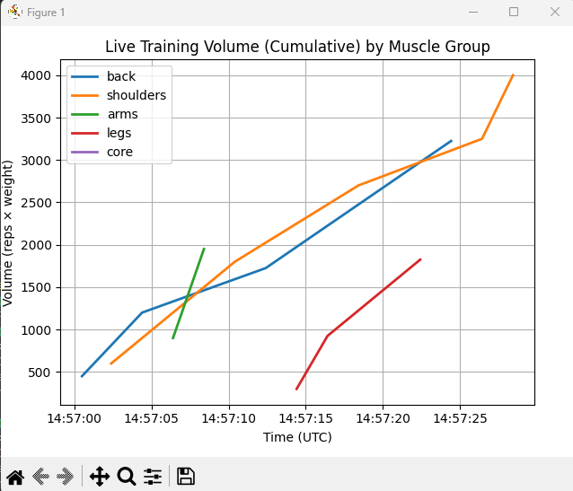

# streaming-data-06-project
Streaming Data: Mod 6 Project

**Course:** Streaming Data – Module 6  
**Date:** September 29, 2025  
**Author:** Justin Schroder  
**GitHub:** [SchroderJ-pixel](https://github.com/SchroderJ-pixel) 

# Live Workout Tracker (Kafka)

## What it does
- Producer streams **JSON** workout set events (reps × weight) by exercise/muscle group.
- Consumer computes **tonnage** per message, updates a per-group running total, appends a row to `processed_results.csv` (optional), and shows a **live bar chart**.

## Setup
```bash
python -m venv .venv
# Windows PowerShell
. .venv/Scripts/Activate.ps1
# or WSL/macOS
# source .venv/bin/activate

pip install -r requirements.txt
Start Kafka (in WSL window)
bash
Copy code
# Zookeeper
bin/zookeeper-server-start.sh config/zookeeper.properties
# Kafka broker (new terminal)
bin/kafka-server-start.sh config/server.properties

# Create topic (only once)
bin/kafka-topics.sh --bootstrap-server localhost:9092 --create --topic workout_volume --partitions 1 --replication-factor 1

# (Optional) check topics
bin/kafka-topics.sh --bootstrap-server localhost:9092 --list
```

## Run the app

### 1) Start producer
python -m producers.producer_workout

### 2) Start consumer (logging version)
python -m consumers.consumer_volume

### 3) Start chart consumer
python -m consumers.consumer_chart

## Message Schema (example)
{
  "ts": "2025-09-29T12:34:56.789012+00:00",
  "session_id": "a1b2c3d4",
  "exercise": "bench_press",
  "group": "chest",
  "reps": 10,
  "weight": 135
}

---

## Live Chart Example

**Live Line Chart (Kafka JSON streaming)**  
Cumulative training volume per muscle group over time.



